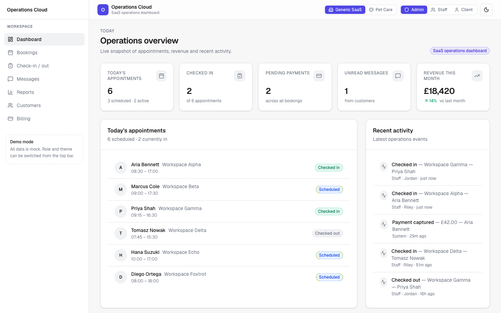
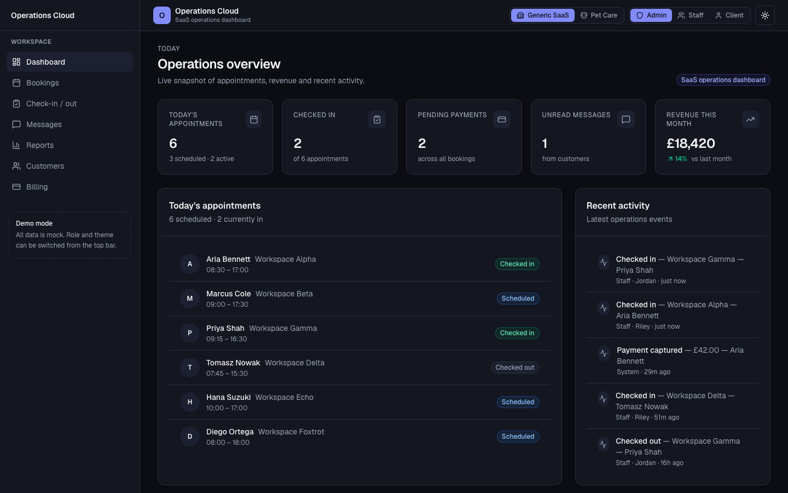
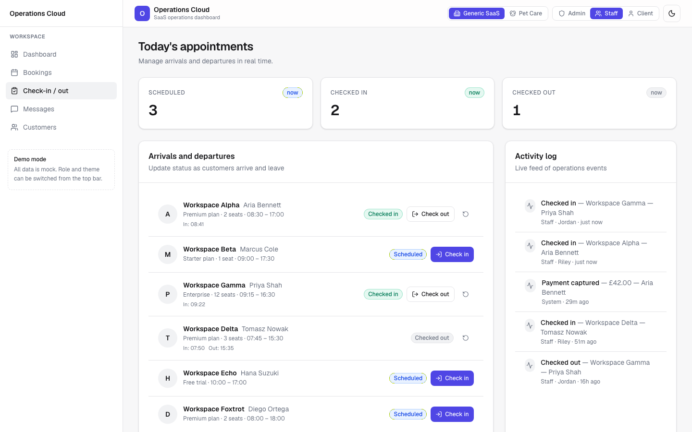
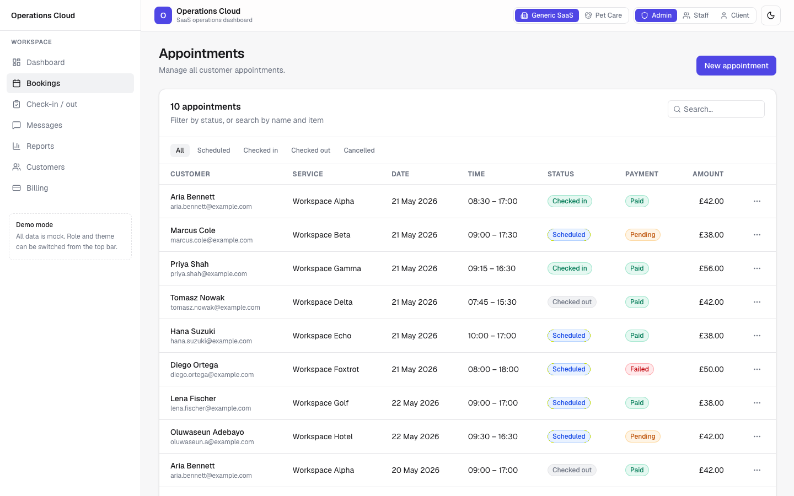
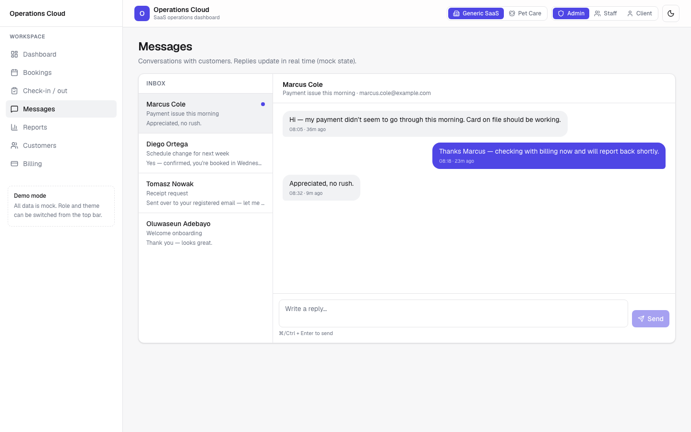
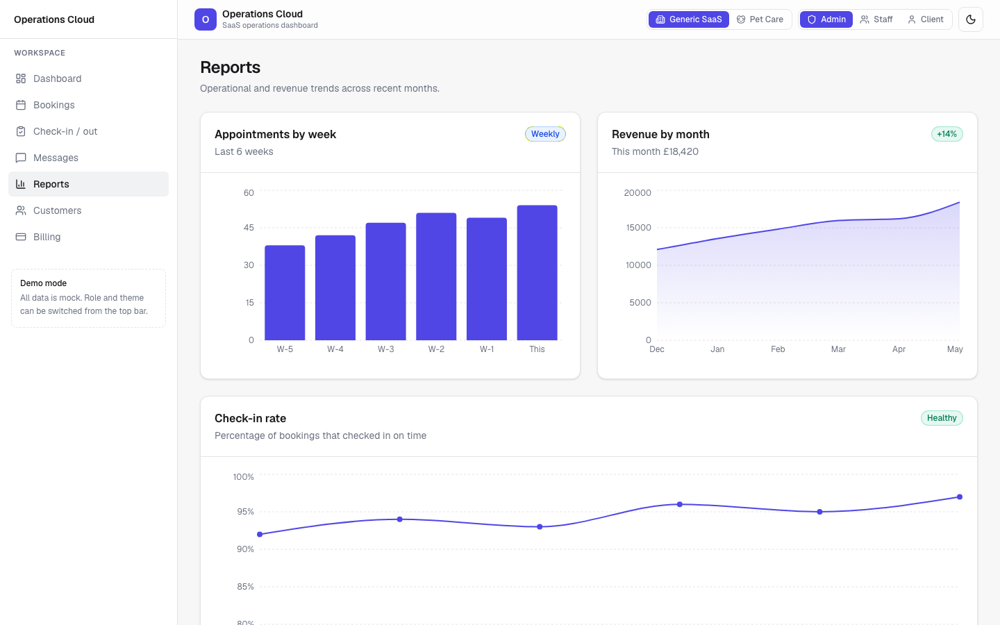
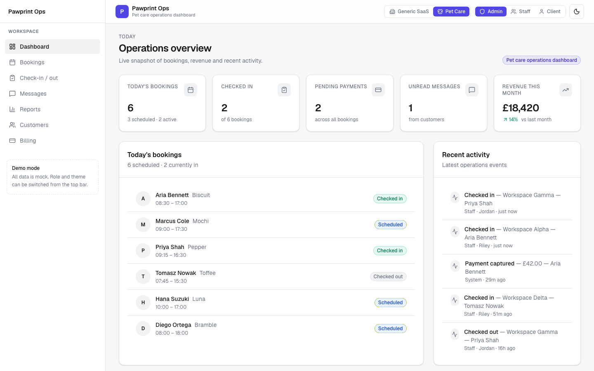
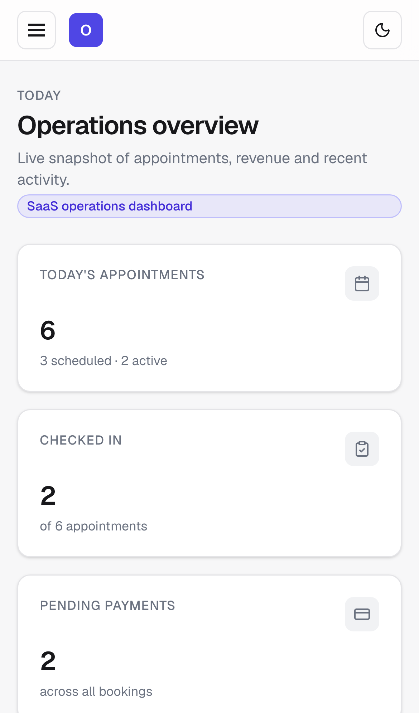
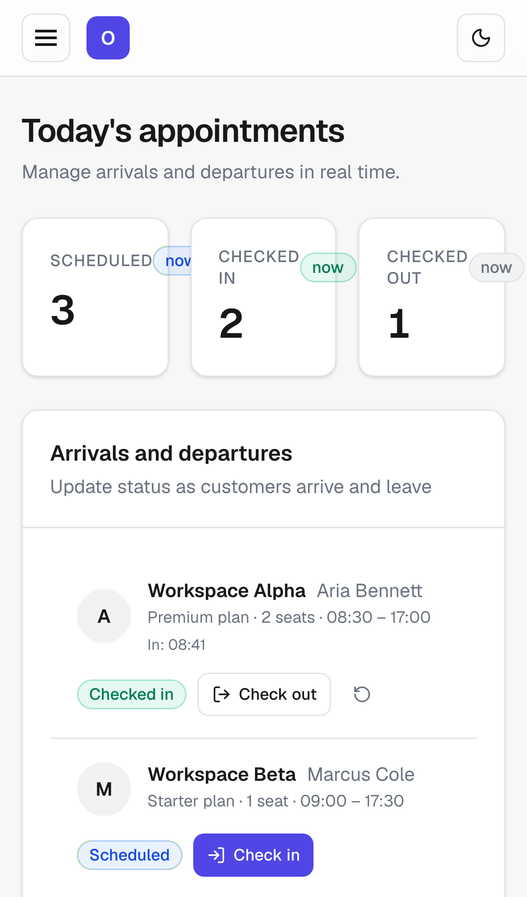

# SaaS Operations Dashboard — Demo

A public demo dashboard inspired by real-world SaaS operations software. Built with **Next.js, React and TypeScript**, featuring **role-based views**, a **check-in / check-out workflow**, **messaging**, and **operational reporting**. Mock data only — safe to share.

> **Live demo:** <https://saas-operations-dashboard-demo.vercel.app>
>
> **Switchable themes:** the same code base ships with two demo skins — a generic SaaS view and a pet-care view — toggled live from the top bar. This is intentional: the same dashboard layout fits many industries (services, appointments, daycare, clinics, studios).

---

## Problem

Operations teams run their day-to-day work across spreadsheets, shared inboxes, and half-built tools. A single dashboard that combines **bookings, check-ins, payments and customer conversations**, with role-appropriate views, removes a lot of that friction.

This repo is a focused demo of that idea — the screens, the workflow, and the polish — without any real production code or customer data.

## Features

- **Role switcher** — Admin / Staff / Client views, with different nav and permissions
- **Theme switcher** — Generic SaaS or Pet Care, swapped from the top bar
- **Dashboard overview** — five KPIs (today's bookings, checked in, pending payments, unread messages, monthly revenue) with delta vs previous month
- **Bookings table** — searchable, status-filterable, with payment status and amounts
- **Check-in / check-out workflow** — drop-off and pickup with timestamps and a live activity log
- **Messaging inbox** — conversation list, message thread, stateful reply box (⌘/Ctrl+Enter to send)
- **Reports** — bookings by week (bar), revenue by month (area), check-in rate (line) via Recharts
- **Customers** — searchable list with plan badges
- **Billing** — collected / pending / failed totals plus payment rows
- **Polish** — loading skeletons, empty states, error boundary, 404, mobile-first responsive, dark mode, preferences persisted in `localStorage`

## Tech stack

- **Next.js 16** (App Router, Turbopack)
- **React 19**
- **TypeScript**
- **Tailwind CSS v4**
- **Recharts** for charts
- **Lucide** for icons
- Mock data only — no database, no auth, no third-party APIs
- Deployed on **Vercel**
- **GitHub Actions** CI: lint + typecheck + build on every PR

## Demo roles

| Role   | Sees                                                            |
| ------ | --------------------------------------------------------------- |
| Admin  | All pages — reports, customers, bookings, billing, messages     |
| Staff  | Operational pages — check-in, bookings, messages, customers     |
| Client | Self-service view — own bookings, billing, messages             |

The role and theme switches live in the top bar. Pages render different content (or block access) based on the active role.

## Operational workflow

The **Check-in / check-out** page is the most polished workflow in the demo:

1. Today's bookings appear with status: `scheduled` → `checked_in` → `checked_out`
2. Action buttons advance status; timestamps are recorded
3. An **Undo** button reverts to the previous state
4. Every action appends to a **live activity log** on the right (newest first)

This pattern — explicit state transitions, audit trail, role-aware actions — is the spine of any real operations tool.

## Screenshots

### Dashboard — light



### Dashboard — dark



### Check-in / check-out workflow



### Bookings table



### Messaging inbox



### Reports



### Pet Care theme variant

The same dashboard, re-skinned via the in-app theme switcher.



### Mobile

<p>
  
  &nbsp;
  
</p>

## Running locally

```bash
git clone https://github.com/jennadebeer89-dotcom/saas-operations-dashboard-demo.git
cd saas-operations-dashboard-demo
npm install
npm run dev
```

Open <http://localhost:3000>.

Other scripts:

```bash
npm run lint       # ESLint
npx tsc --noEmit   # Typecheck
npm run build      # Production build
npm start          # Run production build
```

## Privacy and data

**This is a public demo project.** It uses mock data only and does **not** include:

- real client or customer data
- real payment data
- authentication secrets or API keys
- production business logic
- any private screenshots or database details

All names, emails, phone numbers, and figures are fictional. No external services are called.

## Limitations and future work

This is intentionally a UI demo, not a production app. Things deliberately left out:

- Real authentication (NextAuth, Clerk, etc.)
- A real database (would swap mock data layer for Drizzle/Prisma + Postgres)
- Payment integration (Stripe Checkout, Connect, Billing Portal)
- Real-time updates (would use Pusher / Ably / SSE)
- Server-side data fetching (currently all client-side from mock state)
- Tests (Vitest + React Testing Library would cover the workflow state machine first)

Each of these is straightforward to add — they were skipped to keep the repo focused on the UI and product thinking.

## What this demonstrates

- React + Next.js App Router with client components and persisted state
- TypeScript end-to-end, including typed mock data layer and shared types
- Tailwind v4 design system using CSS custom properties for theming and dark mode
- Reusable UI primitives (`Card`, `Badge`, `Button`, `EmptyState`, `Skeleton`)
- Stateful UI patterns: state machine for booking status, optimistic updates, activity feed
- Multi-tenant / multi-role thinking — same codebase, different views per role
- Configuration-driven theming — same components, different industry skin
- Accessibility basics: `aria-label`, `role="radiogroup"`, focus rings, keyboard send
- CI hygiene: GitHub Actions running lint, typecheck, and build on every change

## License

MIT — see [LICENSE](./LICENSE).
